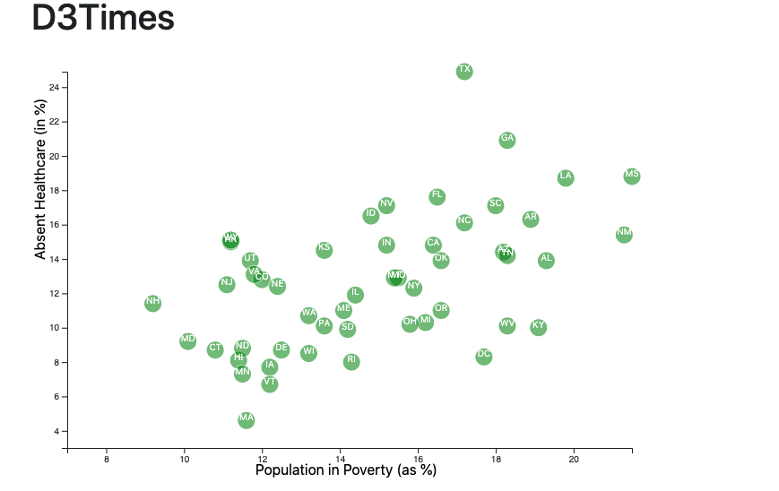

# data-journalism-and-d3

## Background

The data set analyzed is based on 2014 ACS 1-year estimates from the [US Census Bureau](https://data.census.gov/cedsci/). The current data set includes data on rates of income, obesity, poverty, etc. by state. The goal is to create a scatter plot between two data variables in the dataset to show their relationship. I was intrigued by state poverty levels and lack of healthcare so those were the two variables I chose to review.

## Technologies Used to Analyze the Data
* D3
* JavaScript
* CSS
* HTML

### Example of Scatter Plot
* I used D3 techniques to create a scatter plot that represents each stat listed in the dataset with circle elements. The data referenced came from the csv file in the data folder.
* State abbreviations are added for each circle element.
* A mouseover effect is provided for each circle element so you can look at the state's specific data.

